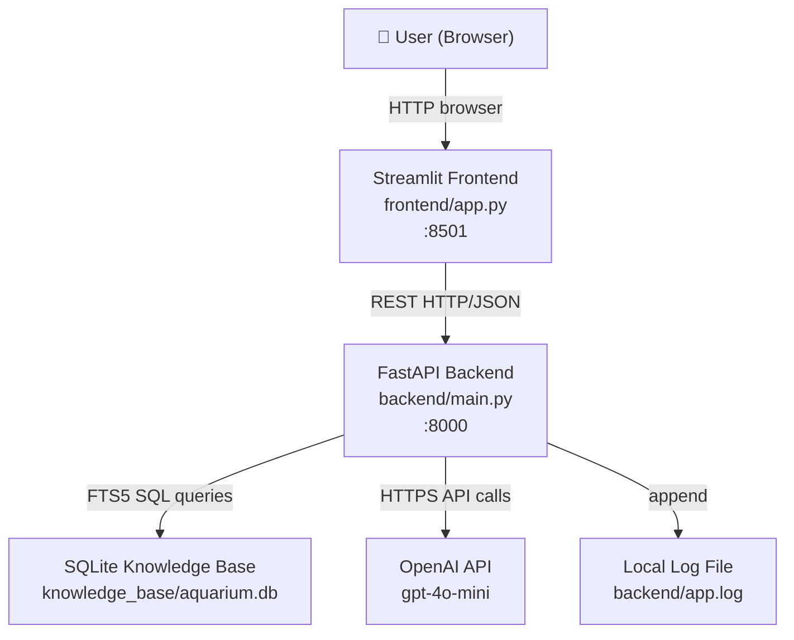
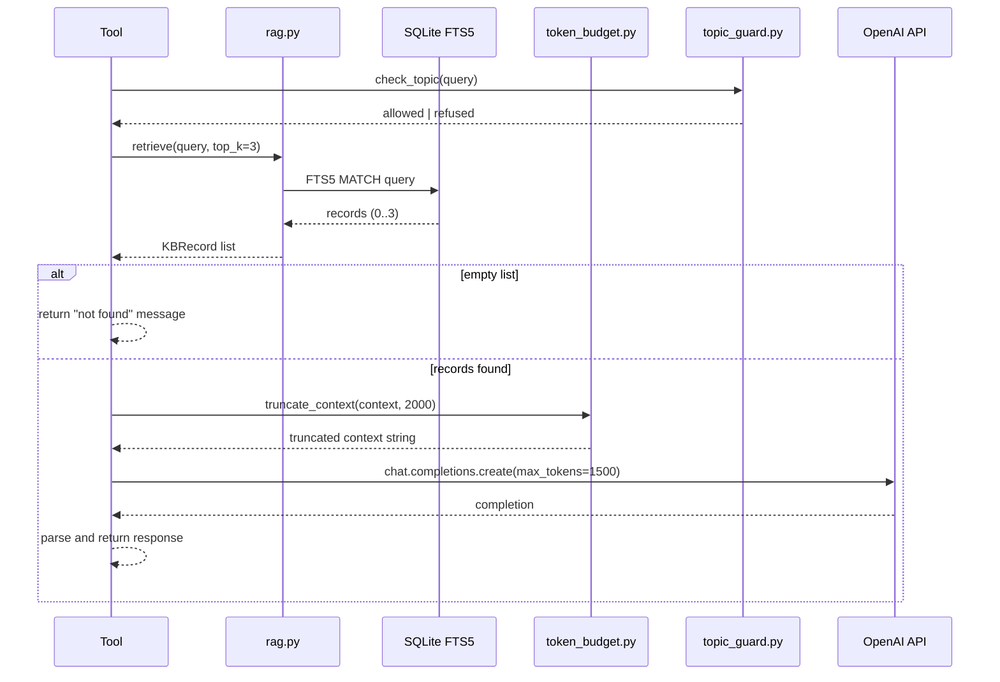

# Design Document: NoFishyBusiness Aquarium Information App

## Overview

NoFishyBusiness is a locally-hosted, AI-assisted aquarium information web application built as a college proof-of-concept. It targets aquarium hobbyists who want accurate, grounded guidance on fish care, tank setup, water chemistry, and maintenance — without relying on cloud databases or external services beyond the OpenAI API.

The system is composed of two processes that run concurrently on the user's machine:

- A **FastAPI backend** that owns all business logic, RAG retrieval, LLM calls, and tool implementations.
- A **Streamlit frontend** that renders the UI and communicates with the backend over HTTP.

All AI responses are grounded through a **RAG (Retrieval-Augmented Generation) pipeline** that queries a local **SQLite knowledge base** using FTS5 full-text search before constructing any LLM prompt. A **Topic Guard** component intercepts every query before it reaches the LLM, rejecting non-aquarium topics. A **Token Budget** enforcer caps every OpenAI API call at 1500 output tokens and 2000 context tokens.

The application exposes eight user-facing capabilities:

| Tool | Description |
|---|---|
| Volume Calculator | Computes tank water volume and weight from dimensions |
| Species Tool | Returns fish care sheets from the knowledge base |
| Maintenance Guide | Explains the nitrogen cycle and feeding/maintenance schedules |
| Setup Guide | Recommends beginner fish, plants, and aquascaping layouts |
| Chemistry Analyzer | Classifies water parameters and suggests corrective actions |
| Image Scanner | Identifies fish/plant species and health indicators from photos |
| AI Assistant | Free-form conversational interface with session memory |
| Evaluation Suite | Offline script that measures AI behavior against labeled test cases |

---

## Architecture

### High-Level System Diagram



### Process Model

Both processes are started by the user. The Streamlit frontend is the entry point (`streamlit run frontend/app.py`). The backend must be running separately (`uvicorn backend.main:app`). The README documents both commands.

```
Terminal 1:  uvicorn backend.main:app --reload --port 8000
Terminal 2:  streamlit run frontend/app.py
```

> **Design Decision**: Keeping the backend and frontend as separate processes (rather than embedding FastAPI inside Streamlit) allows the evaluation script to call the backend directly without a browser, and keeps AI logic isolated from UI code. The rejected alternative was a single-process Streamlit app with inline OpenAI calls, which would have made the eval suite harder to write and mixed concerns.

### Directory Layout

```
NoFishyBusiness/
├── backend/
│   ├── main.py              # FastAPI app, route definitions
│   ├── rag.py               # RAG pipeline (FTS5 retrieval + prompt assembly)
│   ├── topic_guard.py       # Aquarium topic classifier
│   ├── token_budget.py      # Token counting and context truncation
│   ├── tools/
│   │   ├── volume.py        # Volume Calculator logic
│   │   ├── species.py       # Species Tool logic
│   │   ├── maintenance.py   # Maintenance Guide logic
│   │   ├── setup.py         # Setup Guide logic
│   │   ├── chemistry.py     # Chemistry Analyzer logic
│   │   └── image_scanner.py # Image Scanner logic
│   ├── assistant.py         # AI Assistant (session memory + RAG)
│   ├── logger.py            # Structured log writer
│   └── app.log              # Runtime log (gitignored)
├── frontend/
│   ├── app.py               # Streamlit entry point, navigation
│   └── pages/               # One file per tool page
│       ├── volume.py
│       ├── species.py
│       ├── maintenance.py
│       ├── setup.py
│       ├── chemistry.py
│       ├── image_scanner.py
│       └── assistant.py
├── knowledge_base/
│   ├── aquarium.db          # SQLite database (committed to repo)
│   └── seed.py              # Script to populate the database
├── eval/
│   ├── eval.py              # Evaluation runner
│   └── test_cases.json      # Labeled test cases (≥10)
├── .env.example
├── requirements.txt
└── README.md
```

---

## Components and Interfaces

### Backend API (FastAPI)

All endpoints accept and return JSON. The base URL is `http://localhost:8000`.

#### Endpoint Summary

| Method | Path | Tool |
|---|---|---|
| POST | `/volume` | Volume Calculator |
| POST | `/species` | Species Tool |
| POST | `/maintenance` | Maintenance Guide |
| POST | `/setup` | Setup Guide |
| POST | `/chemistry` | Chemistry Analyzer |
| POST | `/image-scan` | Image Scanner |
| POST | `/assistant` | AI Assistant |
| GET | `/health` | Health check |

#### Standard Error Response

All error responses use HTTP 4xx/5xx with a consistent JSON body:

```json
{
  "message": "Human-readable error description",
  "error_type": "validation_error | not_found | api_error | rag_error | topic_refused"
}
```

#### `/volume` — Volume Calculator

```
POST /volume
Request:  { "length": float, "width": float, "depth": float }
Response: { "volume_gallons": float, "weight_pounds": float }
```

Pure calculation — no LLM or RAG involved.

#### `/species` — Species Tool

```
POST /species
Request:  { "species_name": string }
Response: {
  "species_name": string,
  "behavior": string,
  "compatible_tank_mates": [string],
  "temperature_f": { "min": float, "max": float },
  "ph": { "min": float, "max": float },
  "hardness_dgh": { "min": float, "max": float },
  "min_tank_gallons": int,
  "difficulty": "easy" | "moderate" | "advanced",
  "maintenance_notes": string
}
```

#### `/maintenance` — Maintenance Guide

```
POST /maintenance
Request:  { "tank_gallons": float, "fish_count": int, "fish_species": [string] }
Response: {
  "nitrogen_cycle": string,
  "feeding": { "quantity": string, "frequency": string },
  "weekly_tasks": [string],
  "monthly_tasks": [string]
}
```

#### `/setup` — Setup Guide

```
POST /setup
Request:  { "tank_gallons": float, "experience_level": "beginner" | "intermediate" | "advanced" }
Response: {
  "fish_recommendations": [{ "name": string, "difficulty": string, "min_tank_gallons": int }],
  "plant_recommendations": [{ "name": string, "difficulty": string }],
  "aquascaping_idea": { "substrate": string, "hardscape": string, "plant_zones": [string] }
}
```

#### `/chemistry` — Chemistry Analyzer

```
POST /chemistry
Request:  { "description": string, "image_base64": string | null }
Response: {
  "parameters": [
    {
      "name": string,
      "value": string,
      "status": "safe" | "caution" | "danger",
      "corrective_action": string | null
    }
  ],
  "summary": string
}
```

#### `/image-scan` — Image Scanner

```
POST /image-scan
Content-Type: multipart/form-data
Request:  file (JPEG or PNG, ≤10 MB)
Response: {
  "species_name": string | null,
  "confidence": "high" | "medium" | "low" | "inconclusive",
  "care_summary": string,
  "health_assessment": { "issues_detected": [string] | null, "status": string }
}
```

#### `/assistant` — AI Assistant

```
POST /assistant
Request:  {
  "message": string,
  "history": [{ "role": "user" | "assistant", "content": string }]
}
Response: {
  "reply": string,
  "suggested_section": string | null
}
```

The frontend is responsible for maintaining the last 5 message pairs in `history` and sending them with each request.

#### `/health` — Health Check

```
GET /health
Response: { "status": "ok" }
```

Used by the eval suite to verify the backend is reachable before running tests.

---

### RAG Pipeline (`backend/rag.py`)

The RAG pipeline is a shared module called by every LLM-powered tool. It has a single public function:

```python
def retrieve(query: str, top_k: int = 3) -> list[KBRecord]:
    """
    Runs FTS5 full-text search against the knowledge base.
    Returns up to top_k records, or all records if fewer exist.
    Raises RAGError on database failure.
    Returns empty list if no records match (caller handles this case).
    """
```

Internally it:
1. Opens a connection to `knowledge_base/aquarium.db`.
2. Executes `SELECT rowid, species_name, category, content FROM kb_fts WHERE kb_fts MATCH ? ORDER BY rank LIMIT ?` with the query string and `top_k`.
3. Returns a list of `KBRecord` objects.
4. On any `sqlite3.Error`, raises `RAGError` (never returns partial results).

The calling tool then:
1. Checks if the list is empty → returns "not found" message, no LLM call.
2. Concatenates record content into a context string.
3. Passes the context string to `token_budget.truncate_context(context, max_tokens=2000)`.
4. Constructs the system prompt with the truncated context.
5. Calls the OpenAI API.



---

### Topic Guard (`backend/topic_guard.py`)

The Topic Guard runs before every LLM call in the AI Assistant and Chemistry Analyzer. It uses a keyword vocabulary loaded from the knowledge base at startup.

```python
def check_topic(query: str) -> TopicResult:
    """
    Returns TopicResult with:
      - status: "allowed" | "refused" | "ambiguous"
      - message: refusal message if refused
    """
```

Logic:
- **No aquarium terms found** → `refused` — return refusal message, no LLM call.
- **Only aquarium terms found** → `allowed` — proceed normally.
- **Mixed terms (aquarium + off-topic)** → `ambiguous` — forward to LLM with a system instruction to answer only if aquarium-related.

The vocabulary is a set of lowercase terms extracted from `species_name` and `category` fields of all knowledge base records, plus a hardcoded seed list of common aquarium terms (e.g., "fish", "tank", "aquarium", "pH", "nitrate", "ammonia", "cichlid", "planted").

If the knowledge base is unavailable at startup, the backend exits with a non-zero status code (see Requirement 1.6).

---

### Token Budget (`backend/token_budget.py`)

```python
def truncate_context(context: str, max_tokens: int = 2000) -> str:
    """
    Truncates context string to fit within max_tokens using tiktoken
    (cl100k_base encoding for gpt-4o-mini).
    Always returns a string (never raises).
    """

def count_tokens(text: str) -> int:
    """Returns token count for a string."""
```

Every OpenAI API call in the codebase sets `max_tokens=1500`. The `truncate_context` function is called before prompt construction to ensure the context portion never exceeds 2000 tokens.

---

### Logger (`backend/logger.py`)

```python
def log_llm_call(prompt_tokens: int, completion_tokens: int, total_tokens: int) -> None:
    """Appends a JSON line to backend/app.log with UTC timestamp."""

def log_error(error_type: str, detail: str) -> None:
    """Appends a JSON error line to backend/app.log with UTC timestamp."""
```

Log format (newline-delimited JSON):

```json
{"event": "llm_call", "prompt_tokens": 312, "completion_tokens": 148, "total_tokens": 460, "ts": "2025-01-15T14:23:01Z"}
{"event": "llm_error", "error_type": "RateLimitError", "detail": "...", "ts": "2025-01-15T14:23:05Z"}
```

---

### Streamlit Frontend (`frontend/`)

The frontend uses Streamlit's multi-page app structure. `frontend/app.py` defines the navigation sidebar. Each tool lives in `frontend/pages/`.

Navigation is handled by Streamlit's built-in page routing — selecting a page from the sidebar loads that page's module without a full browser reload (Streamlit's SPA behavior).

Each page follows this pattern:

```python
# 1. Render input widgets
# 2. On submit: show st.spinner("Loading...")
# 3. Call backend via requests.post(...)
# 4. On success: render labeled output fields
# 5. On HTTP error: parse error JSON, display st.error(response["message"])
# 6. On requests exception: display st.error("Could not reach the backend. Please try again.")
```

---

## Data Models

### Knowledge Base Schema

The SQLite database has two tables: a regular table for structured data and an FTS5 virtual table for full-text search.

```sql
-- Primary records table
CREATE TABLE IF NOT EXISTS kb_records (
    id          INTEGER PRIMARY KEY AUTOINCREMENT,
    species_name TEXT NOT NULL,   -- fish/plant name or topic name (e.g., "Nitrogen Cycle")
    category    TEXT NOT NULL,    -- "fish" | "plant" | "chemistry" | "maintenance" | "disease" | "aquascaping"
    content     TEXT NOT NULL,    -- full care sheet or knowledge text
    created_at  TEXT DEFAULT (datetime('now'))
);

-- FTS5 virtual table (mirrors kb_records for full-text search)
CREATE VIRTUAL TABLE IF NOT EXISTS kb_fts USING fts5(
    species_name,
    category,
    content,
    content='kb_records',
    content_rowid='id'
);

-- Triggers to keep FTS5 in sync
CREATE TRIGGER kb_ai AFTER INSERT ON kb_records BEGIN
    INSERT INTO kb_fts(rowid, species_name, category, content)
    VALUES (new.id, new.species_name, new.category, new.content);
END;

CREATE TRIGGER kb_ad AFTER DELETE ON kb_records BEGIN
    INSERT INTO kb_fts(kb_fts, rowid, species_name, category, content)
    VALUES ('delete', old.id, old.species_name, old.category, old.content);
END;
```

**Minimum required content at deployment:**

| Category | Minimum Count |
|---|---|
| Fish species care sheets | 20 |
| Water chemistry parameters/thresholds | 1 record per parameter (≥5) |
| Nitrogen cycle stages | 1 record covering all 3 stages |
| Common diseases and treatments | 5 |
| Beginner plant species | 5 |
| Aquascaping basics | 1+ records |

### Python Data Models (Pydantic)

```python
# backend/models.py

from pydantic import BaseModel, Field
from typing import Optional

class KBRecord(BaseModel):
    id: int
    species_name: str
    category: str
    content: str

class VolumeRequest(BaseModel):
    length: float = Field(gt=0, description="Tank length in inches")
    width: float  = Field(gt=0, description="Tank width in inches")
    depth: float  = Field(gt=0, description="Water depth in inches")

class VolumeResponse(BaseModel):
    volume_gallons: float
    weight_pounds: float

class SpeciesRequest(BaseModel):
    species_name: str = Field(min_length=1)

class MaintenanceRequest(BaseModel):
    tank_gallons: float = Field(gt=0)
    fish_count: int     = Field(ge=0)
    fish_species: list[str] = Field(default_factory=list)

class SetupRequest(BaseModel):
    tank_gallons: float = Field(gt=0, le=500)
    experience_level: str = Field(pattern="^(beginner|intermediate|advanced)$")

class ChemistryRequest(BaseModel):
    description: str
    image_base64: Optional[str] = None

class AssistantRequest(BaseModel):
    message: str = Field(min_length=1)
    history: list[dict] = Field(default_factory=list, max_length=10)

class ErrorResponse(BaseModel):
    message: str
    error_type: str
```

### Session Memory Model

The AI Assistant maintains conversation history on the **frontend** side. The Streamlit session state stores the last 5 user–assistant pairs:

```python
# frontend/pages/assistant.py
if "history" not in st.session_state:
    st.session_state.history = []  # list of {"role": str, "content": str}

# On each submit:
# 1. Append user message to history
# 2. POST to /assistant with last 10 items (5 pairs) of history
# 3. Append assistant reply to history
# 4. Trim history to last 10 items
```

The backend receives history as a plain list and prepends it to the LLM messages array — it does not store any session state itself.

---

## Correctness Properties

*A property is a characteristic or behavior that should hold true across all valid executions of a system — essentially, a formal statement about what the system should do. Properties serve as the bridge between human-readable specifications and machine-verifiable correctness guarantees.*


### Property 1: Volume and Weight Calculation Correctness

*For any* positive values of length, width, and depth (in inches), the Volume Calculator SHALL compute `volume_gallons = round((length × width × depth) / 231.0, 2)` and `weight_pounds = round(volume_gallons × 8.34, 2)`, and both values SHALL be present in the response.

**Validates: Requirements 3.1, 3.2**

### Property 2: Non-Positive Dimension Rejection

*For any* input where at least one dimension is less than or equal to zero, the Volume Calculator SHALL return a validation error and SHALL NOT return a volume or weight value.

**Validates: Requirements 3.3**

### Property 3: Species Response Completeness

*For any* species name that exists in the Knowledge Base, the Species Tool SHALL return a response containing all required fields: behavior, compatible_tank_mates, temperature_f (min/max), ph (min/max), hardness_dgh (min/max), min_tank_gallons, difficulty, and maintenance_notes — and none of these fields SHALL be null or empty.

**Validates: Requirements 4.1**

### Property 4: Unknown Species Returns Not-Found

*For any* species name that does not match any record in the Knowledge Base, the Species Tool SHALL return a not-found message and SHALL NOT make an LLM API call.

**Validates: Requirements 4.3**

### Property 5: Maintenance Response Completeness

*For any* valid tank size (gallons > 0) and fish count (≥ 0), the Maintenance Guide SHALL return a response that: (a) covers all three nitrogen cycle stages (ammonia, nitrite, nitrate), (b) includes a non-empty feeding quantity and frequency, (c) contains at least two weekly tasks, and (d) contains at least two monthly tasks.

**Validates: Requirements 5.1, 5.2, 5.3**

### Property 6: Setup Guide Response Completeness

*For any* valid tank size between 1 and 500 gallons with "beginner" experience level, the Setup Guide SHALL return a response containing: (a) at least three fish recommendations all rated "easy" difficulty, (b) at least two plant recommendations all rated "easy" difficulty, and (c) one aquascaping idea with non-empty substrate, hardscape, and plant_zones fields.

**Validates: Requirements 6.1, 6.2, 6.3**

### Property 7: Water Parameter Classification Coverage

*For any* text input containing at least one recognizable water parameter value (ammonia ppm, nitrite ppm, nitrate ppm, pH, or temperature °F), the Chemistry Analyzer SHALL return a classification of "safe", "caution", or "danger" for each recognized parameter — no recognized parameter SHALL be left unclassified.

**Validates: Requirements 7.1**

### Property 8: Corrective Action Presence for Non-Safe Parameters

*For any* Chemistry Analyzer response, every parameter classified as "caution" or "danger" SHALL have a non-null, non-empty corrective_action field.

**Validates: Requirements 7.2**

### Property 9: Image Scanner Response Structure

*For any* valid JPEG or PNG image upload not exceeding 10 MB, the Image Scanner SHALL return a response containing: a confidence field (one of "high", "medium", "low", or "inconclusive"), a non-empty care_summary, and a health_assessment with a non-empty status field. Furthermore, if species_name is null, the confidence field SHALL be "inconclusive".

**Validates: Requirements 8.1, 8.2, 8.5**

### Property 10: Topic Guard Rejects Non-Aquarium Queries

*For any* query string that contains no terms matching the aquarium topic vocabulary, the Topic Guard SHALL return a refusal message and SHALL NOT forward the query to the LLM or make any OpenAI API call.

**Validates: Requirements 10.1, 10.2**

### Property 11: Topic Guard Forwards Ambiguous Queries with System Instruction

*For any* query string that contains at least one aquarium-related term alongside off-topic terms, the Topic Guard SHALL forward the query to the LLM with a system instruction that instructs the LLM to answer only if the question is aquarium-related.

**Validates: Requirements 10.3**

### Property 12: Token Budget Enforcement on All LLM Calls

*For any* LLM API call made by any tool or the AI Assistant, the `max_tokens` parameter SHALL be set to exactly 1500.

**Validates: Requirements 11.1**

### Property 13: Context Truncation Stays Within Budget

*For any* string passed to `truncate_context`, the returned string SHALL have a token count (using cl100k_base encoding) less than or equal to 2000.

**Validates: Requirements 11.2**

### Property 14: Knowledge Base Round-Trip Integrity

*For any* valid Knowledge Base record (with non-empty species_name, category, and content), inserting the record and then retrieving it by its primary key SHALL return a record where species_name, category, and content are identical to the inserted values.

**Validates: Requirements 12.6**

### Property 15: RAG Context Included Verbatim in LLM Prompt

*For any* set of records retrieved by the RAG Pipeline, the verbatim text of each retrieved record's content field SHALL appear in the system prompt sent to the OpenAI API.

**Validates: Requirements 12.2**

### Property 16: Malformed KB Records Are Skipped During Indexing

*For any* Knowledge Base record missing one or more of the required fields (species_name, category, content), the record SHALL be skipped during FTS5 indexing and SHALL NOT be returned by any FTS5 search query.

**Validates: Requirements 12.5**

---

## Error Handling

### Error Categories and Responses

| Error Condition | HTTP Status | `error_type` | Behavior |
|---|---|---|---|
| Invalid input (missing/wrong type) | 422 | `validation_error` | Pydantic auto-validates; field name included in message |
| Non-positive dimension | 400 | `validation_error` | Named field in message |
| Species not found in KB | 404 | `not_found` | No LLM call made |
| RAG pipeline DB error | 503 | `rag_error` | No LLM call made; error logged |
| Topic guard refusal | 200 | `topic_refused` | Refusal message returned; no LLM call |
| OpenAI API error (any) | 502 | `api_error` | Message includes "API error" + error type; logged with UTC timestamp |
| Image format invalid | 400 | `validation_error` | Specifies JPEG/PNG only |
| Image too large | 400 | `validation_error` | Specifies 10 MB limit |
| Image corrupt/non-aquatic | 400 | `validation_error` | Describes issue |
| KB unavailable at startup | — | — | Backend exits with non-zero status code |

### Startup Validation

`backend/main.py` runs a startup check in a FastAPI `lifespan` context manager:

```python
@asynccontextmanager
async def lifespan(app: FastAPI):
    # 1. Check OPENAI_API_KEY is set and non-empty
    # 2. Verify knowledge_base/aquarium.db exists and is readable
    # 3. Load topic guard vocabulary from KB
    # If any check fails: print descriptive error, sys.exit(1)
    yield
```

### LLM Error Handling

All OpenAI API calls are wrapped in a try/except that catches `openai.OpenAIError` and its subclasses:

```python
try:
    response = client.chat.completions.create(...)
    logger.log_llm_call(...)
    return response
except openai.RateLimitError as e:
    logger.log_error("RateLimitError", str(e))
    raise APIError("API error: rate limit exceeded")
except openai.AuthenticationError as e:
    logger.log_error("AuthenticationError", str(e))
    raise APIError("API error: invalid API key")
except openai.OpenAIError as e:
    logger.log_error(type(e).__name__, str(e))
    raise APIError(f"API error: {type(e).__name__}")
```

### Frontend Error Handling

The Streamlit frontend wraps every backend call:

```python
try:
    resp = requests.post(url, json=payload, timeout=30)
    if resp.ok:
        data = resp.json()
        # render labeled output
    else:
        try:
            err = resp.json()
            st.error(f"Error: {err['message']}")
        except Exception:
            st.error("An unexpected error occurred. Please try again.")
except requests.RequestException:
    st.error("Could not reach the backend. Please ensure it is running.")
except Exception:
    st.error("The result could not be displayed. Please retry.")
```

---

## Testing Strategy

### Dual Testing Approach

The project uses two complementary testing layers:

1. **Unit / property-based tests** — verify pure logic, data transformations, and universal invariants.
2. **Integration tests** — verify that components are wired correctly (RAG → LLM ordering, Topic Guard coverage, logging).

The evaluation suite (`eval/eval.py`) serves as a third layer: end-to-end behavioral tests against the running backend.

### Property-Based Testing

Property-based testing is appropriate for this feature because several components are pure functions (volume calculator, token budget truncation, KB round-trip) and several have universal structural invariants (response completeness, topic guard behavior, parameter classification).

**Library**: [Hypothesis](https://hypothesis.readthedocs.io/) (Python) — the standard PBT library for Python.

**Configuration**: Each property test runs a minimum of 100 examples (`@settings(max_examples=100)`).

**Tag format**: Each property test is tagged with a comment:
```python
# Feature: no-fishy-business-aquarium-site, Property N: <property_text>
```

#### Property Test Implementations

```python
# tests/test_properties.py
from hypothesis import given, settings, strategies as st
import pytest

# Property 1: Volume and Weight Calculation Correctness
# Feature: no-fishy-business-aquarium-site, Property 1: Volume and weight are computed correctly for any positive dimensions
@given(
    length=st.floats(min_value=0.01, max_value=1000.0),
    width=st.floats(min_value=0.01, max_value=1000.0),
    depth=st.floats(min_value=0.01, max_value=1000.0),
)
@settings(max_examples=100)
def test_volume_calculation_correctness(length, width, depth):
    result = calculate_volume(length, width, depth)
    expected_volume = round((length * width * depth) / 231.0, 2)
    expected_weight = round(expected_volume * 8.34, 2)
    assert result["volume_gallons"] == expected_volume
    assert result["weight_pounds"] == expected_weight

# Property 2: Non-Positive Dimension Rejection
# Feature: no-fishy-business-aquarium-site, Property 2: Non-positive dimensions are rejected
@given(
    length=st.floats(max_value=0.0),
    width=st.floats(min_value=0.01, max_value=1000.0),
    depth=st.floats(min_value=0.01, max_value=1000.0),
)
@settings(max_examples=100)
def test_non_positive_dimension_rejected(length, width, depth):
    with pytest.raises(ValidationError):
        calculate_volume(length, width, depth)

# Property 13: Context Truncation Stays Within Budget
# Feature: no-fishy-business-aquarium-site, Property 13: truncate_context always returns ≤2000 tokens
@given(text=st.text(min_size=0, max_size=50000))
@settings(max_examples=100)
def test_context_truncation_budget(text):
    result = truncate_context(text, max_tokens=2000)
    assert count_tokens(result) <= 2000

# Property 14: Knowledge Base Round-Trip Integrity
# Feature: no-fishy-business-aquarium-site, Property 14: KB insert then retrieve returns identical fields
@given(
    species_name=st.text(min_size=1, max_size=100),
    category=st.sampled_from(["fish", "plant", "chemistry", "maintenance", "disease", "aquascaping"]),
    content=st.text(min_size=1, max_size=5000),
)
@settings(max_examples=100)
def test_kb_round_trip(species_name, category, content, tmp_db):
    record_id = insert_record(tmp_db, species_name, category, content)
    retrieved = get_record_by_id(tmp_db, record_id)
    assert retrieved.species_name == species_name
    assert retrieved.category == category
    assert retrieved.content == content
```

### Unit Tests

Unit tests cover specific examples, edge cases, and error conditions not covered by property tests:

- Volume Calculator: non-numeric input (422 from Pydantic), zero dimensions
- Species Tool: known species returns all fields, unknown species returns 404
- Chemistry Analyzer: input with no parameters returns prompt message
- Image Scanner: wrong file type returns 400, oversized file returns 400
- Topic Guard: pure aquarium query is allowed, pure off-topic query is refused
- RAG Pipeline: empty FTS5 result returns empty list, DB error raises RAGError
- Logger: LLM call writes correct JSON fields to log file
- Startup: missing API key causes sys.exit(1)

### Integration Tests

Integration tests use `pytest` with mocked OpenAI client and real SQLite (in-memory or temp file):

- RAG is called before OpenAI in every LLM-powered tool
- Topic Guard is invoked on every `/assistant` and `/chemistry` request
- `max_tokens=1500` is present in every mocked OpenAI call
- Log file receives an entry for every mocked LLM call

### Evaluation Suite

The `eval/eval.py` script runs end-to-end against the live backend:

- Minimum 10 labeled test cases in `eval/test_cases.json`
- At least 3 correct aquarium answer cases
- At least 2 correct off-topic refusal cases
- At least 1 "not found" case for an unknown species
- At least 1 water chemistry assessment case
- Output format: `[PASS|FAIL] <test_name> (<label>): <reason>`
- Exits with non-zero status if any test fails
- Exits with non-zero status if backend is unreachable (checked via `GET /health`)
